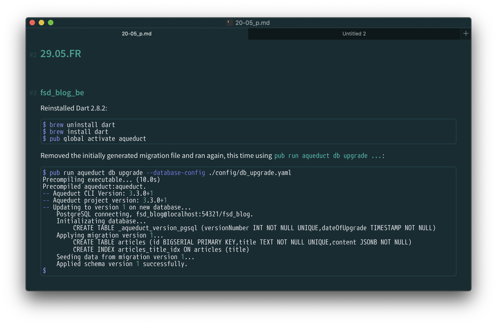
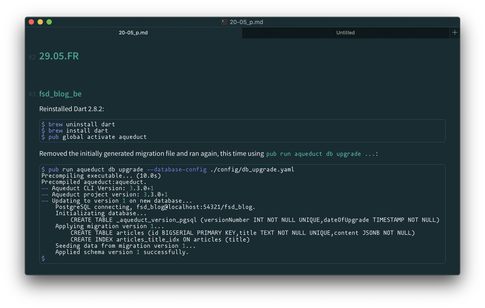

## Greenview - A Typora theme

A green theme to be used in [Typora](https://typora.io) editor.

Highly influenced by my preferences of green and solarized dark like color schemes. Most of the credits goes to [LostKeys](https://theme.typora.io/theme/Lostkeys/) and [Solarized](https://theme.typora.io/theme/Solarized/) themes authors. I just adjusted some colors, sizes and corner roundness.

### Installation

Based on the operating system you use, the location where to put the theme files is different. Go to Typora's `Preferences > Appearance` menu path and click `Open Theme Folder` button to find that location.

For example, on macOS the location is `/Users/{username}/Library/Application Support/abnerworks.Typora/themes`.

### Monospaced Fonts

The monopaced fonts that are configured (in this order) are:
- [M+ 1mn](https://mplus-fonts.osdn.jp/about-en.html)
- [Mononoki](https://github.com/madmalik/mononoki)

However, you can customize the font to be used by updating this line in `greenview.css` file: 
`--monospace-font: "mplus-1mn", "Mononoki", monospace;`

## Screenshots

As this is very visual related thing, see below some samples.

Using _M+ 1mn_ font:

Using _Mononoki_ font:

Using _Letter Gothic FS Medium_ font, something that I bought and use it sometimes:

